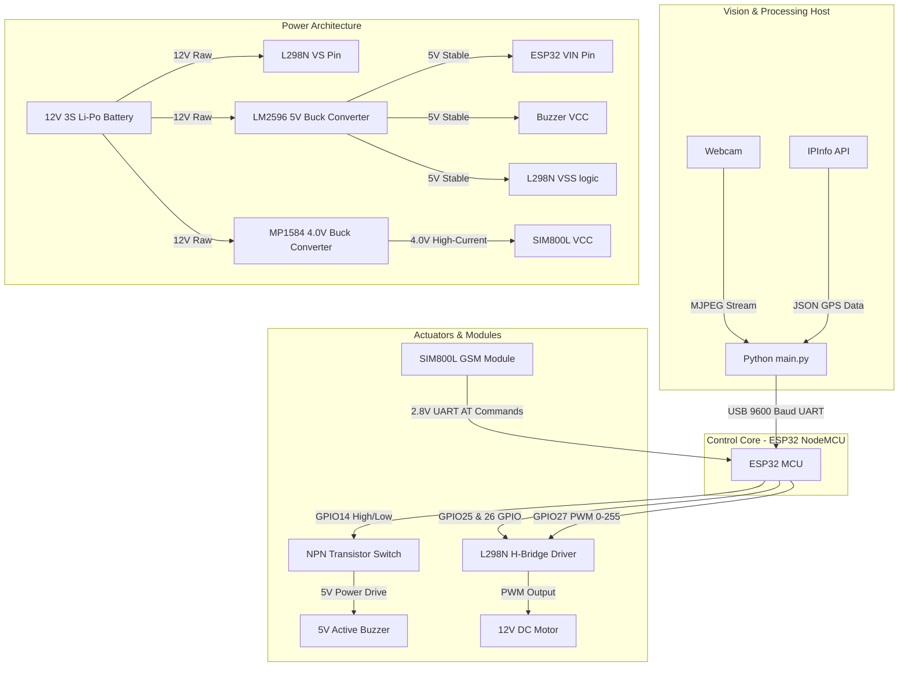

# 🛠️ Complete Electronic Hardware Design & Schematic Analysis
## Driver Drowsiness Detection & Vehicle Safety System

This document provides a highly detailed, professional, production-ready electronic hardware design and reverse-engineered schematic for the **Driver Drowsiness Detection & Vehicle Safety System**. The design has been meticulously derived from the software logic, module requirements, and timing constraints defined in `main.py` and `esp32_controller.ino`.

---

## 1. System Block Diagram & Signal Flow

The system consists of three main domains:
1. **The Vision/Processing Host (PC)**: Runs the MediaPipe computer vision model and handles GPS coordinate resolution.
2. **The Control Core (ESP32)**: Processes high-level commands ('N', 'W', 'E') via UART and coordinates the actuators.
3. **The Power & Actuation Subsystem**: Drives high-current loads (DC motor, GSM module) and auditory alarms safely.

### Signal Flow Schematic (Mermaid Diagram)


---

## 2. Complete Circuit Schematic & Wire Mapping

The circuit diagram below details every connection, passive component, and power rail required to construct a reliable, noise-free system.

### Electrical Connections Table
| From Module/Component | Pin Name | To Module/Component | Pin Name | Connection Type / Description |
| :--- | :--- | :--- | :--- | :--- |
| **ESP32 NodeMCU** | `VIN` | **LM2596 Buck Out** | `OUT+` (5V) | Main 5V Power Supply |
| **ESP32 NodeMCU** | `GND` | **Common Ground** | `GND` | Common Ground Bus |
| **ESP32 NodeMCU** | `GPIO25` | **L298N Module** | `IN1` | Direction Control Line A |
| **ESP32 NodeMCU** | `GPIO26` | **L298N Module** | `IN2` | Direction Control Line B |
| **ESP32 NodeMCU** | `GPIO27` | **L298N Module** | `ENA` | PWM Speed Control Line |
| **ESP32 NodeMCU** | `GPIO14` | **Buzzer Driver** | Base Resistor $R_1$ | Buzzer Trigger Output (Active High) |
| **ESP32 NodeMCU** | `TXD0 (GPIO1)` | **SIM800L Module** | `RXD` (via $R_2$ / $R_3$) | UART TX (Requires 2.8V conversion) |
| **ESP32 NodeMCU** | `RXD0 (GPIO3)` | **SIM800L Module** | `TXD` (direct or via $R_4$) | UART RX (ESP32 is 3.3V, SIM800L is 2.8V) |
| **L298N Module** | `VS` (12V) | **12V Source** | Fuse $F_1$ Output | High-voltage motor power rail |
| **L298N Module** | `GND` | **Common Ground** | `GND` | Power Ground Connection |
| **L298N Module** | `VSS` (5V) | **LM2596 Buck Out** | `OUT+` (5V) | Logic circuitry supply voltage |
| **L298N Module** | `OUT1` | **DC Motor** | Terminal A | Motor Output A |
| **L298N Module** | `OUT2` | **DC Motor** | Terminal B | Motor Output B |
| **SIM800L Module** | `VCC` | **MP1584 Buck Out** | `OUT+` (4.0V) | GSM Power Rail (Needs up to 2A bursts) |
| **SIM800L Module** | `GND` | **Common Ground** | `GND` | RF Power Ground Connection |

---

## 3. Detailed Component Specifications (BOM)

To prevent component failures under peak loads (especially during GSM transmission and motor startup), the components listed below have been selected with strict margins.

### Bill of Materials (BOM)
| Item | Qty | Reference | Component Name | Recommended Model | Specifications & Ratings | Rationale |
| :--- | :--- | :--- | :--- | :--- | :--- | :--- |
| **1** | 1 | `MCU1` | ESP32 Development Board | NodeMCU ESP32 DEVKIT V1 | Dual-core Tensilica Xtensa, 3.3V logic, on-board CP2102 | Handles multi-tasking, UART, and hardware PWM generation. |
| **2** | 1 | `U1` | Dual H-Bridge Motor Driver | L298N Module | Dual H-Bridge, $I_{out} = 2\text{A}$ continuous, $V_{ss}$ up to 35V | Drives the high-current DC motor with integrated flyback protection. |
| **3** | 1 | `U2` | GSM/GPRS Module | SIM800L MicroGSM | Quad-band 850/900/1800/1900MHz, UART interface | Handles SMS emergency messaging and cellular calls. |
| **4** | 1 | `M1` | 12V DC Gear Motor | Standard 37GB555 | Operating Voltage: 12V, $I_{load} = 300\text{mA}$, $I_{stall} = 1.5\text{A}$ | Represents the car drive motor configured in code logic. |
| **5** | 1 | `LS1` | Active electromagnetic buzzer | TMB12A05 | Operating Voltage: 5V, Current consumption: $\le 30\text{mA}$ | Generates loud auditory warning alarms. |
| **6** | 1 | `Q1` | NPN BJT Transistor | 2N2222A (or PN2222) | $V_{CEO} = 40\text{V}$, $I_C = 800\text{mA}$, $h_{FE} \ge 100$ | Acts as a low-side switch to drive the 30mA buzzer from a 3.3V GPIO. |
| **7** | 1 | `D1` | Schottky Diode (Buzzer) | 1N4148 | $V_R = 100\text{V}$, $I_F = 150\text{mA}$ | Flyback diode to suppress inductive voltage spikes from the buzzer. |
| **8** | 1 | `D2` | Power Rectifier Diode | 1N5408 | $V_R = 1000\text{V}$, $I_F = 3\text{A}$ | Reverse polarity protection diode at main power input. |
| **9** | 1 | `F1` | Resettable PPTC Fuse | RGEF300 (or equivalent) | Holding Current: 3.0A, Trip Current: 6.0A, Max Voltage: 16V | Safety protection against motor stalls or short-circuits. |

---

## 4. Passive Components (Resistors & Capacitors)

Using active modules directly without decoupling or level-shifting passives will result in erratic microcontrollers, fried pins, or failure of the GSM module to register on the cellular network.

```
       [ESP32 TXD0 (3.3V)] --- [ 1kΩ Resistor ] ---+--- [SIM800L RXD (2.8V Level)]
                                                   |
                                              [ 2.2kΩ Resistor ]
                                                   |
                                                 [GND]
```

### Passive Component Specifications & Placement
1. **Buzzer Base Resistor ($R_1$)**:
   - **Value**: $1\text{ k}\Omega$, $0.25\text{W}$, 5% tolerance.
   - **Placement**: Connects in series between ESP32 `GPIO14` and the base of BJT Transistor `Q1`.
   - **Rationale**: Limits the current out of the ESP32 GPIO pin to a safe $2.6\text{mA}$, while driving the transistor fully into saturation ($I_C/I_B \approx 11$).

2. **SIM800L RX Line Level Shifter Divider ($R_2$, $R_3$)**:
   - **$R_2$ Value**: $1\text{ k}\Omega$, $0.125\text{W}$, 1% metal film.
   - **$R_3$ Value**: $2.2\text{ k}\Omega$, $0.125\text{W}$, 1% metal film.
   - **Placement**: $R_2$ in series between ESP32 `TXD0` (GPIO1) and SIM800L `RXD`. $R_3$ connected from SIM800L `RXD` to `GND`.
   - **Rationale**: Steps down the 3.3V output level of the ESP32 TX pin to an optimal $2.26\text{V}$ (logic high threshold for SIM800L is 2.8V nominal, with a maximum toleration of 3.0V). This prevents thermal degradation of the SIM800L UART core.

3. **SIM800L TX Protection Resistor ($R_4$)**:
   - **Value**: $220\ \Omega$, $0.125\text{W}$, 5% tolerance.
   - **Placement**: Connected in series between SIM800L `TXD` and ESP32 `RXD0` (GPIO3).
   - **Rationale**: Limits any potential high-state cross-talk currents during startup.

4. **SIM800L VCC Bulk Decoupling Capacitor ($C_1$)**:
   - **Value**: $1000\ \mu\text{F}$, low-ESR Electrolytic, rated for $10\text{V}$ minimum.
   - **Placement**: Placed directly across the `VCC` and `GND` pins of the SIM800L module.
   - **Rationale**: SIM800L draws instantaneous pulse currents of up to **2.0A** during antenna transmission bursts (lasting $\sim 577\ \mu\text{s}$). Without this reservoir capacitor, the input voltage drops below $3.4\text{V}$, triggering a sudden module brownout and reset.

5. **SIM800L Ceramic Decoupling ($C_2$, $C_3$)**:
   - **Values**: $100\text{ nF}$ and $33\text{ pF}$ Ceramic Capacitors.
   - **Placement**: Parallel to $C_1$ as close to the SIM800L module pins as possible.
   - **Rationale**: Filters out high-frequency RF noise ($33\text{ pF}$ targets $900/1800\text{MHz}$ GSM bands) preventing interference from corrupting the MCU logic.

6. **Motor Snubber/Filter Capacitors ($C_4, C_5, C_6$)**:
   - **Values**: $3 \times 100\text{ nF}$ Ceramic Capacitors.
   - **Placement**: $C_4$ directly across the motor terminals; $C_5$ from terminal A to metal motor chassis; $C_6$ from terminal B to metal chassis.
   - **Rationale**: Extremely critical for suppressing high-frequency electromagnetic interference (EMI) generated by the DC motor brushes, which otherwise induces ground bounce and resets the ESP32.

---

## 5. Power Supply & Thermal Architecture

The system utilizes a single high-capacity **12V 3S Li-Po Battery** (or a 12V 3A DC Wall Adapter) as the primary energy source. Two buck-converters step down this high voltage efficiently to minimize thermal losses.

### Power Budget Calculations (Maximum Demands)
| Component | Rail | Operating Voltage (V) | Typical Current (mA) | Peak Current (mA) | Peak Power (W) |
| :--- | :--- | :--- | :--- | :--- | :--- |
| **ESP32 NodeMCU** | 5V Input | 5.0V | 80 mA | 240 mA (WiFi Burst) | 1.20 W |
| **L298N Logic** | 5V Input | 5.0V | 36 mA | 36 mA | 0.18 W |
| **Active Buzzer** | 5V Input | 5.0V | 30 mA | 30 mA | 0.15 W |
| **SIM800L GSM** | 4.0V Input | 4.0V | 15 mA (Idle) | 2000 mA (Tx Burst) | 8.00 W |
| **12V DC Motor** | 12V Input | 12.0V | 300 mA (Load) | 1500 mA (Stall) | 18.00 W |

### Total System Power Footprint
* **Average Operating Power**: $\approx 6.0\text{ W}$
* **Worst-Case Peak Power (Stall Motor + GSM Active Transmission)**: $27.53\text{ W}$

### Buck Converter Selection & Calibration
1. **5V Rail Supply (LM2596 Step-Down Module)**:
   - **Input**: 12.0V Nominal
   - **Output**: 5.0V regulated
   - **Rated Current**: 3A continuous
   - **Supplies**: ESP32, L298N logic rail, Buzzer VCC.
2. **4V Rail Supply (MP1584 high-efficiency buck converter)**:
   - **Input**: 12.0V Nominal
   - **Output**: Calibrated precisely to **4.0V** (via trim-pot)
   - **Rated Current**: 3A maximum peak
   - **Supplies**: SIM800L VCC directly.
   * *Note: Using linear regulators like LM7805 or AMS1117 is strongly discouraged. To drop 12V to 4V at 2A peak would generate $(12\text{V} - 4\text{V}) \times 2\text{A} = 16\text{W}$ of instant heat, causing immediate thermal shutdown.*

---

## 6. Detailed Schematic Design: Actuator Interfaces

### 6.1. Safe Buzzer Drive Circuit (NPN Transistor Switch)
Since an ESP32 GPIO pin cannot safely sink/source the $30\text{mA}$ required by the electromagnetic buzzer, a low-side BJT transistor driver is implemented.

```
                  +5V (from LM2596)
                   |
                   +-------+------------+
                   |       |            |
                  [+]    [ B ]        [D1] 1N4148
                Buzzer   [ E ]      (Anode to Transistor,
                  [-]    [ E ]      Cathode to +5V)
                   |       |            |
                   +-------+------------+
                           |
                           v
                       [Collector]
     ESP32                 |
     GPIO14 ───[ 1kΩ ]───[Base]   Q1 (2N2222A)
                           |
                       [Emitter]
                           |
                          GND
```

---

## 7. PCB & Breadboard Layout Recommendations

### Breadboard Connection Layout
1. Keep the **high-current components** (L298N, DC Motor, SIM800L power input) on one side of the breadboard, and the **sensitive analog/logic components** (ESP32, level shifters, BJT base lines) on the opposite side.
2. **Never** route the 2A SIM800L burst current through a sequence of daisy-chained breadboard jumper wires. Connect the output of the 4V Buck Converter and its $1000\ \mu\text{F}$ capacitor directly to the SIM800L VCC and GND pins using thick hookup wire (22 AWG).

### PCB Design Guidelines (Traces, Grounding, and EMI)
1. **Trace Width Allocation (1oz/ft² Copper Thickness)**:
   - **Main 12V Power Input & Motor Output Traces**: Minimum width **1.2 mm (47 mils)** to handle 3A spikes without exceeding a 10°C temperature rise.
   - **4.0V GSM Supply Trace**: Minimum width **1.2 mm (47 mils)**, and must be kept extremely short ($\le 25\text{ mm}$) to avoid inductive voltage drops during transmission.
   - **Standard Logic Signal Traces (UART, GPIO, PWM)**: **0.25 mm (10 mils)**.

2. **Ground Plane Architecture**:
   - Utilize a **Star Grounding topology**. Designate the negative terminal of the 12V battery as the single system ground reference point (Common Star Ground).
   - Separate the Ground planes into two zones: **Power Ground (PGND)** (Motor, L298N power ground, Buck converter outputs) and **Signal Ground (SGND)** (ESP32 ground, level shifter references).
   - Tie SGND and PGND together at a single point (the common star ground) via a $0\ \Omega$ bridge resistor or a narrow trace. This prevents high-frequency motor switching noise from injecting noise into the ESP32 logic ground plane.

---

## 8. Safety, Protection, and Reliability Measures

1. **Short Circuit & Overcurrent Protection**:
   - Install a **3.0A PPTC Resettable Fuse** ($F_1$) in series with the positive lead of the 12V battery. In the event of a DC motor stall or accidental power-rail short, the fuse will heat up and open the circuit, preventing fire or component destruction.
2. **Reverse Polarity Protection**:
   - A high-current **1N5408 diode** ($D_2$) is connected in series right after the fuse. If the battery is connected backward, the diode blocks all current flow, saving the downstream regulators and microcontroller.
3. **Inductive Spike Suppression**:
   - The L298N H-Bridge board contains internal clamping diodes.
   - For the Buzzer, flyback diode `D1` (1N4148) is connected in reverse-bias directly across the buzzer terminals to clamp the back-EMF spike generated when BJT transistor `Q1` switches off.
4. **GSM Antenna Clear Zone**:
   - Place the SIM800L whip antenna at least **50 mm** away from the ESP32 board and high-current lines to prevent RF noise from coupling into the UART lines.

---

## 9. Quick-Reference System Verification Checklist

Before applying power to the assembled system, perform the following verification steps with a digital multimeter:

- [ ] **Check 1: Logic Level Verification**  
  Unplug the ESP32 and SIM800L modules. Apply 12V to the input. Measure the output of the LM2596 buck converter: it must read between **4.9V and 5.1V**. Measure the output of the MP1584 buck converter: adjust the trim-pot until it reads exactly **4.0V**.
- [ ] **Check 2: Continuity Short-Circuit Test**  
  With the battery disconnected, measure resistance between the `12V`, `5V`, `4V` rails and the `GND` bus. The meter should display a high, non-zero resistance. If it reads $<100\ \Omega$, check for solder bridges or component failures.
- [ ] **Check 3: Ground Loop Prevention**  
  Confirm that the L298N ground, ESP32 ground, buck grounds, and SIM800L ground are all tied back to a single common node.
